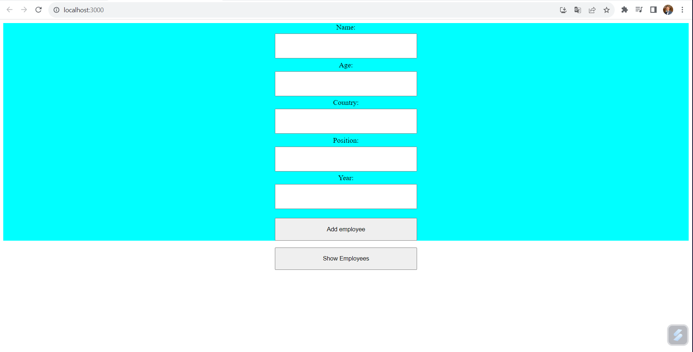
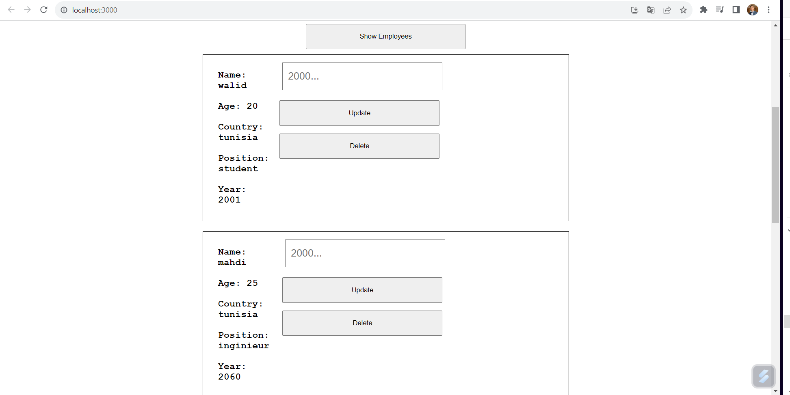

# RH-TOOL
J'ai développé RH TOOL, une application web complète de gestion des employés en utilisant ReactJS, MySQL et Node.js. 
Cette plateforme permet de manière intuitive d'ajouter, visualiser et mettre à jour les informations détaillées des employés. 
Avec une interface conviviale et des fonctionnalités robustes, RH TOOL simplifie la gestion administrative des ressources humaines, offrant un moyen efficace et centralisé pour suivre et gérer les données des employés.

[English]

I developed RH TOOL, a comprehensive web application for employee management using ReactJS, MySQL, and Node.js. 
This platform intuitively allows adding, viewing, and updating detailed employee information. 
With a user-friendly interface and robust features, RH TOOL simplifies HR administrative management, providing an efficient and centralized way to track and handle employee data.

